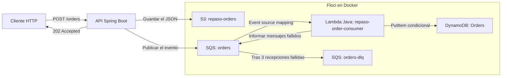

# AWS + Java con Floci

Este proyecto es un laboratorio de procesamiento de pedidos con Java 21. Una API de Spring Boot recibe pedidos por HTTP, conserva cada pedido como JSON en S3 y publica un mensaje en SQS. Una Lambda consume los mensajes y registra los pedidos procesados en DynamoDB. Todo se ejecuta en la máquina local: [Floci](https://github.com/floci-io/floci) emula los servicios de AWS y Docker ejecuta el emulador y el runtime de Lambda. No se necesita una cuenta AWS para recorrer el flujo local.

## Qué construye el laboratorio



S3 conserva el pedido original, SQS desacopla la recepción del procesamiento y DynamoDB guarda el resultado procesado. Estos recursos y Lambda son locales a Floci, accesibles desde la máquina en `http://localhost:4566`. La API corre fuera del emulador, en `http://localhost:8086`. Para ejecutar la Lambda, Floci crea un contenedor de runtime mediante el socket de Docker.

## Cómo funciona un pedido

1. El cliente envía un JSON con `orderId`, `customerId` y `total` a `POST /orders`. La API valida que esos campos estén presentes.
2. La API guarda el JSON en `s3://repaso-orders/<orderId>.json` y, después, envía el mismo contenido a la cola `orders`. Responde `202 Accepted` cuando ambas operaciones terminaron; eso **no significa** que Lambda ya haya procesado el mensaje. Si alguna operación falla, la API responde con un error.
3. El event source mapping entrega mensajes de SQS a `repaso-order-consumer` en lotes de hasta cinco. Lambda escribe `orderId`, `customerId`, `total` y `status=processed` en la tabla `Orders` de DynamoDB.
4. La escritura usa `attribute_not_exists(orderId)`: si SQS vuelve a entregar un pedido ya procesado, Lambda lo reconoce como duplicado y lo da por completado. Si un mensaje falla, Lambda informa su identificador para que SQS lo reintente. Después de tres recepciones fallidas, la política de la cola lo envía a `orders-dlq` para inspección.

El guardado en S3 y la publicación en SQS son dos operaciones separadas. Si S3 funciona y SQS falla, el archivo queda guardado sin evento. El laboratorio permite observar esa limitación y practicar el procesamiento asíncrono, los duplicados y la cola de errores.

## Ejecutar el laboratorio

```bash
git clone https://github.com/JonasGarcia1/aws-java-floci-labs.git
cd aws-java-floci-labs
```

## Requisitos y perfil local

Antes de comenzar, contar con Java 21, Maven 3.9 o posterior, Docker en ejecución y AWS CLI v2. Crear un perfil exclusivo para el emulador en `~/.aws/config` y `~/.aws/credentials`:

```ini
# ~/.aws/config
[profile floci]
region = us-east-1
output = json
```

```ini
# ~/.aws/credentials
[floci]
aws_access_key_id = test
aws_secret_access_key = test
```

Las credenciales son ficticias. No exportar credenciales reales durante estos pasos.

## Paso 1: preparar Floci y los recursos

Levantar el emulador. Lambda inicia contenedores de runtime, así que esta composición agrega el socket Docker a Floci:

```bash
docker compose -f compose.yaml -f compose.lambda.yaml up -d
docker compose ps
```

En PowerShell, crear el bucket, la cola principal, la DLQ y la tabla:

```powershell
.\scripts\init-floci.ps1
```

En Bash/WSL, usar:

```bash
./scripts/init-floci.sh
```

El resultado esperado incluye `ORDERS_QUEUE_URL` y `ORDERS_DLQ_URL`. La cola mueve un mensaje a `orders-dlq` después de tres recepciones fallidas. Comprobar el perfil con:

```bash
aws --profile floci --endpoint-url http://localhost:4566 s3api list-buckets
```

**Práctica resuelta:** inspeccionar la política de reintentos de la cola:

```powershell
aws --profile floci --endpoint-url http://localhost:4566 sqs get-queue-attributes --queue-url http://localhost:4566/000000000000/orders --attribute-names RedrivePolicy QueueArn
```

Verificar que `maxReceiveCount` sea igual a `3` y que aparezca el ARN de `orders-dlq`. Los archivos que implementan este paso son [`compose.yaml`](compose.yaml), [`compose.lambda.yaml`](compose.lambda.yaml) y los [scripts de creación de recursos](scripts/).

## Paso 2: publicar pedidos desde Spring Boot

Construir y arrancar la API con el perfil local. La configuración de la API usa Floci en `http://localhost:4566` por defecto. En PowerShell:

```powershell
$env:AWS_PROFILE = 'floci'
$env:AWS_ENDPOINT_URL = 'http://localhost:4566'
$env:ORDERS_QUEUE_URL = 'http://localhost:4566/000000000000/orders'
mvn spring-boot:run
```

En otra terminal PowerShell, publicar un pedido:

```powershell
Invoke-RestMethod -Uri http://localhost:8086/orders -Method Post -ContentType 'application/json' -Body '{"orderId":"pedido-001","customerId":"cliente-7","total":42.50}'
```

En Bash/WSL, ejecutar el comando equivalente:

```bash
curl -X POST http://localhost:8086/orders -H 'Content-Type: application/json' -d '{"orderId":"pedido-001","customerId":"cliente-7","total":42.50}'
```

La respuesta contiene el pedido. El JSON también queda en `s3://repaso-orders/pedido-001.json` y el evento se envía a SQS.

**Práctica resuelta:** confirmar la copia en S3 y el mensaje pendiente o ya procesado:

```bash
aws --profile floci --endpoint-url http://localhost:4566 s3 cp s3://repaso-orders/pedido-001.json -
aws --profile floci --endpoint-url http://localhost:4566 sqs get-queue-attributes --queue-url http://localhost:4566/000000000000/orders --attribute-names ApproximateNumberOfMessages
```

La API escribe primero en S3 y después en SQS. Son dos operaciones independientes: si S3 funciona y SQS falla, el objeto queda guardado sin evento. En un sistema real se suele resolver esa brecha con un outbox, una reconciliación o una estrategia de reintentos; esta práctica la deja visible en vez de prometer atomicidad. El código está en [`OrderService.java`](src/main/java/com/jonas/repaso/aws/OrderService.java) y [`OrdersController.java`](src/main/java/com/jonas/repaso/aws/OrdersController.java).

## Paso 3: procesar eventos con Lambda y DynamoDB

En otra terminal, construir el JAR de Lambda y crear la función más su event source mapping de SQS:

```powershell
mvn package
.\scripts\deploy-floci-lambda.ps1
```

La función `repaso-order-consumer` ejecuta el handler `OrderConsumerHandler` con Java 21. El mapping entrega lotes de hasta cinco mensajes y habilita `ReportBatchItemFailures`, por lo que un mensaje inválido se reintenta sin volver a entregar los elementos exitosos del mismo lote.

**Práctica resuelta:** después de publicar `pedido-001`, consultar la tabla. Cuando Lambda completa el evento, `get-item` muestra `status=processed`:

```bash
aws --profile floci --endpoint-url http://localhost:4566 dynamodb get-item --table-name Orders --key '{"orderId":{"S":"pedido-001"}}'
```

La escritura usa `attribute_not_exists(orderId)`. Si SQS vuelve a entregar el mismo pedido, DynamoDB rechaza la segunda escritura y el handler confirma el duplicado como exitoso. Así la entrega al menos una vez de SQS no crea un fallo repetido. Revisar [`OrderConsumerHandler.java`](src/main/java/com/jonas/repaso/aws/OrderConsumerHandler.java) y el [script de despliegue local](scripts/deploy-floci-lambda.ps1).

## Paso 4: probar fallos, reintentos y DLQ

La prueba integral automatiza la API, S3, SQS, Lambda, DynamoDB, un evento duplicado y un mensaje inválido que termina en la DLQ:

```powershell
.\scripts\test-floci-e2e.ps1
```

La salida final `OK` confirma que el objeto se guardó, Lambda procesó el pedido y su duplicado, y el evento inválido llegó a `orders-dlq`. El handler informa a SQS cuáles elementos del lote fallaron. El origen de eventos y la política de redrive limitan los intentos; los logs de Floci se pueden consultar con:

```bash
docker compose logs -f floci
```

**Práctica resuelta:** ejecutar la prueba, buscar el pedido con prefijo `e2e-` en DynamoDB y recibir el mensaje de la DLQ:

```bash
aws --profile floci --endpoint-url http://localhost:4566 dynamodb scan --table-name Orders
aws --profile floci --endpoint-url http://localhost:4566 sqs receive-message --queue-url http://localhost:4566/000000000000/orders-dlq --max-number-of-messages 1
```

El mensaje inválido se conserva para inspección. La prueba de integración existente para S3 está en [`FlociS3IntegrationTest.java`](src/test/java/com/jonas/repaso/aws/FlociS3IntegrationTest.java); la prueba completa del flujo está en [`test-floci-e2e.ps1`](scripts/test-floci-e2e.ps1).

## Paso 5: verificar y limpiar

Al terminar, borrar los recursos locales y detener Floci:

```powershell
.\scripts\cleanup-floci.ps1
```

**Práctica resuelta:** comprobar que `docker compose ps` no muestre el contenedor. El script borra función, mapping, colas, tabla y bucket antes de detener Floci. Los recursos son locales al emulador.

## Qué valida Floci y qué requiere AWS

Este proyecto fija la imagen `floci/floci:2.1.0`. Floci documenta creación e invocación de Lambda, mappings SQS y ejecución del runtime dentro de Docker. La versión 2.1.0 incluye el arreglo de reintentos que permite que los fallos parciales vuelvan a la cola y activen su redrive a la DLQ. El socket es necesario para que Floci cree el contenedor de Lambda. La emulación permite practicar el recorrido y observar resultados locales.

Floci no certifica IAM real, cuotas, disponibilidad, latencia ni todas las reglas de reintento administradas por AWS. El mapping local no reemplaza una validación en una cuenta real.
